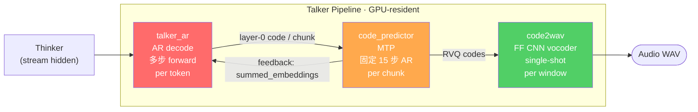

# Talker Pipeline Perf 优化演进

> **面向问题**：怎么设计一个 TTS 流式推理服务？怎么优化一个多 stage 的 AR 推理 pipeline？
>
> 本文以 sglang-omni 的 Qwen3-Omni Talker pipeline 为样本，从 [#169](https://github.com/sgl-project/sglang-omni/pull/169) 最初落地，到 [#276](https://github.com/sgl-project/sglang-omni/issues/276) 暴露问题、[#316](https://github.com/sgl-project/sglang-omni/pull/316) benchmark 把它定量化、[#319](https://github.com/sgl-project/sglang-omni/pull/319) 解决吞吐、[#314](https://github.com/sgl-project/sglang-omni/pull/314) 为继续优化铺底，一路讲到 [#320](https://github.com/sgl-project/sglang-omni/issues/320)（Piecewise CUDA Graph for talker 以及 MoE 精度困境）这一当前最核心、我自己正在全力以赴解决的问题。

---

## 目录

- [0. Preliminary：Talker Pipeline 长什么样](#0-preliminarytalker-pipeline-长什么样)
- [1. #169：落地 Talker，但没有并发](#1-169落地-talker但没有并发)
- [2. #276：Perf 问题第一次正面暴露](#2-276perf-问题第一次正面暴露)
- [3. #316：Benchmark 把问题定量化](#3-316benchmark-把问题定量化)
- [4. #319：Opportunistic Micro-Batching 把 throughput 吃满一半](#4-319opportunistic-micro-batching-把-throughput-吃满一半)
- [5. #314：为什么剩下的事要放到大重构里做](#5-314为什么剩下的事要放到大重构里做)
- [6. #320：Piecewise CUDA Graph 与 MoE 精度困境（当前重点）](#6-320piecewise-cuda-graph-与-moe-精度困境当前重点)
- [7. Design：怎么设计一个 TTS 流式推理服务](#7-design怎么设计一个-tts-流式推理服务)
- [8. Trade-offs](#8-trade-offs)
- [9. Review & Deep Dive](#9-review--deep-dive)

---

## 0. Preliminary：Talker Pipeline 长什么样

Qwen3-Omni 是 Thinker-Talker 双模型。Thinker 吐出 hidden states 之后，Talker 端的 3 个 stage 串联才能产出音频：



三个 stage 对应的 workload 特征完全不一样，这是后面所有设计取舍的根源：

| Stage | 工作性质 | 每次 forward 的含义 | 是否天然能 batch |
| --- | --- | --- | --- |
| `talker_ar` | Autoregressive decode | 1 个 audio token → 1 次 forward | 需要 continuous batching（长度不齐） |
| `code_predictor` | MTP / 固定步数 AR | 从 layer-0 code + hidden，生成剩余 num_code_groups-1 层 | 能！每个 chunk 都是**固定** 15 步，长度对齐 |
| `code2wav` | 单次前向 vocoder | 一段多层 codes → 一段波形 | 能！single-shot，pad 到 max_len |

把这张表刻进脑子里。后面 [#319](https://github.com/sgl-project/sglang-omni/pull/319) 只动后两者、不动第一个，根本原因就在这。

> **所以 Talker pipeline 的核心设计复杂度，其实是从 AR 这一个点放射出来的**：AR 逼着你每步一次 forward，逼着你做 continuous batching、逼着你关心 per-step 的 framework overhead，逼着你关心 CUDA graph，逼着你关心 kernel 精度（因为误差会累积），逼着你关心 HOL blocking。下面 6 个 PR 基本上都是在处理 AR 带来的不同侧面。

---

## 1. #169：落地 Talker，但没有并发

[PR #169](https://github.com/sgl-project/sglang-omni/pull/169) 是 Talker 的首次落地：+6414 行，引入了 `talker_executor.py`、`code_predictor_executor.py`、`code2wav_executor.py`，以及 `engines/omni/runtime/sglang_ar.py` 的 661 行改动，把 Qwen3-Omni 的音频生成能力从 0 做到 1。

**这个 PR 最大的历史债务是什么？**

1. **无 test，无 benchmark**。整个 speech pipeline 的交付只保证「能跑通」，没有任何回归防线。后面 #276 / #316 暴露的 perf 问题，本质上是这个 PR 在 throughput / latency 维度上的黑盒积累。
2. **三个 executor 各自用 `asyncio.Lock` 独占 GPU**。大体形态是这样（用当前代码里的惯例改写，参考 `code_predictor_executor.py` 早期状态）：

   ```python
   async def run(self, payload):
       async with self._gpu_lock:      # ← 全局 lock，强制 serialize
           return await loop.run_in_executor(
               self._forward_pool, self._forward, payload
           )
   ```

   含义是：**每条请求进来都要抢这个 lock**，抢到的独占 GPU，其他请求只能 `await`。stage 和 stage 之间有异步、有并行，但 stage 内部是强制 serialize 的。

3. **Thinker 已经是 batched（走 sglang main 的 continuous batching），Talker 三个 stage 是 one-at-a-time**。这种不对称会让压力全部堆到 Talker 端。

**后果：c=8 的 throughput ≈ c=1 的 throughput，GPU 利用率 < 15%。**

这一条在 [#276 里 Xuesong 的 profiling](https://github.com/sgl-project/sglang-omni/issues/276#issuecomment-4265262805) 被原样量化出来（4×H100）：

| stage          | c=1   | c=2   | c=4   | c=8   |
|----------------|-------|-------|-------|-------|
| thinker        | 0.9%  | 1.0%  | 0.5%  | 0.5%  |
| talker_ar      | 3.8%  | 3.4%  | 3.1%  | 3.2%  |
| code_predictor | 11.3% | 12.6% | 14.7% | 13.6% |
| code2wav       | 0.6%  | 0.3%  | 0.8%  | 0.6%  |

**每一 stage 的 GPU 利用率都在 15% 以下**。瓶颈不是算力不够，而是**我们没把 GPU 喂饱**。

> **我的理解**：#169 的 lock 其实是一个 "correctness-first, perf-later" 的实用选择。一个新流水线先跑对，再谈 batching。问题是这个 lock 后来被当成默认，没人主动把它换掉——直到 CI 接入，thinker-only 到 thinker+talker 10 倍差距才把它顶出水面。这是一个典型的「正确性债务被 CI 暴露」的故事，也是为什么下面 #276 要先动的原因。

---

## 2. #276：Perf 问题第一次正面暴露

[Issue #276](https://github.com/sgl-project/sglang-omni/issues/276) 的出场不是为了优化 Talker，而是为了做 CI 合并：

**目标**：把 `test_qwen3_omni_mmmu_ci.py`（thinker-only 文本正确率） 和 `test_qwen3_omni_mmmu_tts_consistency_ci.py`（thinker+talker 用 Whisper 算 WER）合并成一个，用同样 50 条 MMMU 样本、`enable_audio=True`、c=8、`max_tokens=2048`。

**结果**：放弃合并。原因一句话——**talker pipeline 太慢，没法在 CI 里跑完**。

从 [@zhaochenyang20 的总结](https://github.com/sgl-project/sglang-omni/issues/276)：

> Even at concurrency=8, the thinker batches text generation but the audio generation happens one-at-a-time. With `max_tokens=2048`, the model generates ~500 tokens of CoT reasoning per sample, and the talker must convert all of that to audio. Each sample takes several minutes for audio generation alone, making 50 samples at concurrency=8 take well over an hour.

拆开看，这一条 issue 至少同时暴露了 4 个独立问题：

| 维度 | 观察到的现象 | 根因 |
| --- | --- | --- |
| **Throughput** | `code_predictor` / `code2wav` serialize GPU | `asyncio.Lock`（=#169 债务） |
| **Latency** | ~2 min/sample，500 CoT tokens 要分钟级合成 | AR per-token forward + 无 CUDA graph |
| **Scheduler HOL** | Talker AR 请求进 `WAITING_FEEDBACK` 后 block 整个 decode batch | `SGLangBatchPlanner` 实现问题 |
| **CI 可用性** | 老的 TTS consistency test 只能 5 条 × max_tokens=50 × c=1 | 上面三者共同后果 |

`@knitcapcat-amd` 在 issue 里提出的 phased plan 和后来实际发生的一一对应：

1. **Phase 1**: code2wav micro-batching（→ [#310](https://github.com/sgl-project/sglang-omni/pull/310)，被 [#319](https://github.com/sgl-project/sglang-omni/pull/319) 接管）
2. **Phase 2**: code_predictor micro-batching（→ 并入 #319）
3. **Phase 3**: Talker AR HOL blocking / continuous batching（→ 留给 #314 + 之后）

> **我的理解**：#276 的价值不在于给出某个优化本身，而在于**完成了从"talker 好像有点慢"到"talker 的 4 个独立瓶颈和各自估计收益"的诊断**。Profiling 数据做到 stage-level 的 GPU 利用率，18× code_predictor/code2wav busy ratio 直接告诉你 Phase 2 比 Phase 1 收益大。这是把「感觉慢」翻译成「每 stage 值多少 ms、值多少倍 speedup」的关键一步。

---

## 3. #316：Benchmark 把问题定量化

[PR #316](https://github.com/sgl-project/sglang-omni/pull/316) 本身是一个文档 PR——给四个 benchmark 入口脚本加 `H200 Full-Set Reference Results`。但它间接把一个之前只是「慢」的问题**变成了「15/50 timeout」这个数字**，从而成为 #319 讨论里反复引用的 baseline。

关键 datapoint，在 [@zhaochenyang20 #319 review 评论](https://github.com/sgl-project/sglang-omni/pull/319#issuecomment-4285827214) 里被展开为一张 mechanism-level 的表（4×H200, c=1, `max_tokens=2048`, client timeout 300s）：

| Sample | tokens | expected (513ms × N) | actual | result |
|--------|--------|----------------------|--------|--------|
| #0     | 244    | ~125s                | 128s   | ✅ pass |
| #4     | 290    | ~149s                | 178s   | ✅ pass |
| #1     | 669    | ~343s                | 279s   | ✅ pass (marginal) |
| #3     | 617    | ~316s                | 283s   | ✅ pass (marginal) |
| #2     | 794    | ~407s                | 415s   | ❌ timeout |

**被这张表"定量"出来的事实**：

- Per-token latency ≈ **513 ms** （远超单 GPU 理论值，完全是 framework overhead 占主导）
- 折算 RTF ≈ **6.4**（= 生成 1 秒音频需要 6.4 秒实际时间；streaming TTS 可用阈值是 RTF < 1）
- 失败率 ≈ P(CoT token 数 > ~585)，**和 concurrency 无关**
- Client 的 300s timeout 不是 server 的 bug，是 per-token latency × token count 在长样本上线性超限

**关键结论**：这是一个 latency 问题，不是 throughput 问题。

这一条决定了 #319 的 scope——它只能解 throughput、不能解 latency：

- c=1 时 `_pending` queue 里只有一条请求，#319 的 micro-batching 走 `len(live) == 1` 的 fast path，**等价于原来的 `async with self._gpu_lock`**，所以 1.0× speedup；
- c=1 是 MMMU-audio CI 的实际配置，所以 #319 的 speedup 对 #316 的 15/50 timeout **没有直接帮助**；
- 真正要解 latency 必须动 per-token / per-step 的绝对耗时 → CUDA graph、KV cache、fused kernel。

> **我的理解**：很多人看到 #319 获得 15× 吞吐就以为问题解决了。但 #316 的 benchmark 其实揭示了一件非常本质的事——**throughput 和 latency 的优化技术是正交的**，#319 能把 queue 攒起来一起做省了很多重复工作，但单样本的 forward 该多久还多久。要把单样本 513ms/token 打下来，必须动 forward 本身的 critical path，这也就是 #320 的位置。

---

## 4. #319：Opportunistic Micro-Batching 把 throughput 吃满一半

[PR #319](https://github.com/sgl-project/sglang-omni/pull/319)（我的 PR，接手 [#310](https://github.com/sgl-project/sglang-omni/pull/310)）把 code2wav 和 code_predictor 两个 stage 的 `asyncio.Lock` 替换成一个**opportunistic micro-batching scheduler**。benchmarks（1× H200，32 requests/level）：

**code2wav**:

| c | req/s | speedup |
|---|---|---|
| 1 | 46.35 | 1.00× |
| 2 | 117.32 | 2.53× |
| 4 | 210.67 | 4.55× |
| 8 | 369.12 | 7.96× |
| 16 | 484.03 | 10.44× |

**code_predictor** (chunks_per_request=10):

| c | req/s | chunks/s | speedup |
|---|---|---|---|
| 1 | 1.57 | 15.7 | 1.00× |
| 2 | 3.14 | 31.4 | 2.00× |
| 4 | 6.27 | 62.7 | 3.99× |
| 8 | 12.45 | 124.5 | 7.93× |
| 16 | 24.74 | 247.4 | 15.76× |

Main 线是 flat in concurrency（lock-bound），这个 PR 是 near-linear scaling。

### 4.1 Opportunistic 的核心机制

以 `code2wav_executor.py:_batch_decode_step` 为例（和 `code_predictor_executor.py:_batch_predict_step` 结构一致）：

```python
async def _batch_decode_step(self) -> None:
    loop = asyncio.get_running_loop()

    # 1) 等第一条请求；没有请求时这里 block，CPU 不烧
    first = await self._pending.get()
    batch: list[_DecodeRequest] = [first]

    # 2) 第一条到了之后立刻看还能顺手捞多少；上限 max_batch_size
    while not self._pending.empty() and len(batch) < self._max_batch_size:
        try:
            batch.append(self._pending.get_nowait())
        except asyncio.QueueEmpty:
            break

    live = [...]  # 扫掉已 abort 的

    # 3) 关键：fast path，c=1 不付 batching 代价
    if len(live) == 1:
        audio = await loop.run_in_executor(
            self._forward_pool, self._vocoder_forward,
            r.codes_window, r.trim_samples,
        )
        _finalize(r, audio)
    else:
        audios = await loop.run_in_executor(
            self._forward_pool, self._forward_batch, live,
        )
        for req, audio in zip(live, audios):
            _finalize(req, audio)
```

三件关键事：

1. **"Opportunistic" = 不等 timer、不等 min batch size**。第一条到了立刻开始；顺手捞到的就一起算，没捞到就单条算。和 TGI / vLLM 的 continuous batching 不是同一套——那一套是 per-step 决定 batch 组成；这一套是 per-request single-shot。
2. **c=1 走 fast path**，语义等同旧的 lock，**无 latency overhead**。
3. **forward 本身放进 `self._forward_pool` 的线程池**，用 `run_in_executor` 丢过去。这一层把 GPU kernel launch 和 asyncio event loop 彻底解耦：event loop 只处理 batch 组装、abort、future 派发，**从不 block 在 GPU 上**。

### 4.2 code_predictor 为什么能直接 `.generate()` batched？

`_CodePredictorWrapper.forward` 里直接：

```python
predictor_result = self._talker.code_predictor.generate(
    inputs_embeds=torch.cat((hidden, layer0_embed), dim=1),
    max_new_tokens=self._talker.config.num_code_groups - 1,
    do_sample=False, temperature=0.0,
    output_hidden_states=True, return_dict_in_generate=True,
)
```

能这么做有三个先决条件都满足：

1. **固定步数**：`max_new_tokens = num_code_groups - 1`（~15），batch 内所有请求步数一致。
2. **greedy decoding**：`do_sample=False, temperature=0.0`，没有 per-request 的随机性分化。
3. **输入形状可 stack**：所有请求的 `talker_hidden [H]`、`layer0_code []` 都能直接 `torch.stack` 成 `[B, H]` / `[B]`。

这让 code_predictor 成为一个**单次 forward 就处理 batch 的 AR**——相当于把 15 步 AR 当成一个 single-shot op 对外暴露了。它不是 continuous batching，但它是**能用 opportunistic batching 的 AR 特例**，`talker_ar` 没这个属性。

### 4.3 为什么 E2E 不是 16× 而是 3-5×（Pipeline 天花板公式）

```
Pipeline throughput = min(stage_throughput_i)
```

加完 #319 之后各 stage 吞吐：

```
talker_ar    → code_predictor → code2wav
serialized      ~15× (fixed)     ~10× (fixed)
 ← bottleneck
```

`talker_ar` 依然是 locked 的（#319 scope 里没动）——pipeline 的上限被 `talker_ar` 压死。

### 4.4 为什么 `talker_ar` 没 fix？

因为 `talker_ar` 是**真·autoregressive decode**：每生 1 个 audio token 一次 forward，不同请求的生成长度不齐。这三个性质让它不能用 opportunistic：

| 需求 | opportunistic batching | talker_ar 需要 |
| --- | --- | --- |
| 每次 op 是 single-shot | ✅ 假设如此 | ❌ 每 token 一次 forward |
| batch 内长度一致 | ✅ 同步开始同步结束 | ❌ 动态增删 |
| 可静态 pad | ✅ | ❌ KV cache / attention mask 动态变化 |

所以 `talker_ar` 需要的是 **continuous batching**（vLLM / sglang main 的那套，per-step 决定 batch 组成、支持 request 动态入队出队）。这意味着要动 `SGLangBatchPlanner` 和 Scheduler 层——**这就是为什么必须放到 #314 的大重构里做**。

---

## 5. #314：为什么剩下的事要放到大重构里做

[PR #314](https://github.com/sgl-project/sglang-omni/pull/314) 是 Jingwen 的 refactor progress tracker（+7813 / -12331），大体按 [#188](https://github.com/sgl-project/sglang-omni/issues/188) 的 design doc 走。它不是一个 bugfix，它是在**把 #169 引入的「Stage → Worker → Executor → Engine 四层重叠」塌成「Stage → Engine」**。

### 5.1 为什么要这么大动？

`#319` 的 scope 之外，后面要做的每一件事都跨越当前的抽象边界：

| 下一步要做的事 | 需要打穿的抽象 |
| --- | --- |
| Talker AR continuous batching | `SGLangBatchPlanner` 的 batch planner 重写 |
| Piecewise CUDA graph on talker | sglang-native model runner 替换 HF PyTorch native |
| code_predictor KV cache | 从 HF `.generate()` 换成 hand-written AR + paged KV |
| Cross-stage IPC（talker_ar ↔ code_predictor） | 进程间 communication 层改成 shared memory / 合并进程 |
| Same GPU multi-stage memory mgmt | 共享 KV pool / 统一 allocator |
| 新模型接入（Ming-Omni、Fish Audio flow matching、streaming input） | 重新定义 executor / scheduler 的契约 |

这些东西每一个单独在旧架构里打补丁都能做，但做完之后代码会烂掉。#314 做的事是**先把"接下来这半年想做的所有事"共同依赖的底座先铺好**。

Jingwen 在 `#314` tracker 里列的 Optimization 子项里，排在第一位的正是：

> - [ ] **Piecewise CUDA Graph for talker, high performance/precision talker backend** @JingwenGu0829
> - [ ] High-performance code predictor backend / KV cache management (half finished by @JingwenGu0829, need help)

### 5.2 #314 尚未动的事项（从 tracker body 提取）

- **Ming-Omni support** @yuan-luo
- **Flow Matching / Diffusion** @FrankLeeeee
- **Streaming real-time input** @PopSoda2002
- **TP support** @edwingao28 @yuan-luo
- **Same GPU, multiple stage's memory management**
- **Server args config pipeline (CLI support)** @JingwenGu0829
- **Qwen-Omni Piecewise CUDA Graph** @JingwenGu0829（← #320，下一节）
- **High-performance code predictor backend / KV cache management**

---

## 6. #320：Piecewise CUDA Graph 与 MoE 精度困境（当前重点）

[Issue #320](https://github.com/sgl-project/sglang-omni/issues/320) 是 Jingwen 在 refactor `talker + mtp` CUDA graph capture 过程中发现的——**graph capture 本身能给 talker 带来 ~3× 加速**，但立刻把一个更深的问题推到台面上：**Talker 用的 MoE kernel 没有一个同时满足"CUDA-graph friendly + 精度可用"的**。

这是当前我（和 Jingwen）最主要在解决的问题。

### 6.1 三个 MoE kernel 的取舍

| Kernel | CUDA graph | 精度（WER） | 备注 |
| --- | --- | --- | --- |
| `native_moe` | ❌（Python loop per expert，host-sync）| ✅ **2.22%**（current best） | PyTorch-native，每个 expert 串行 |
| `fused_native` | ✅ | 中间 | 物化 `w1[topk_ids]`, `w2[topk_ids]`→**OOM risk on multimodal inputs** |
| `.experts()`（sglang 官方）| ✅（piecewise graph friendly） | ❌ **3.2%** | 活跃维护、和 thinker 对齐，但精度掉点 |

关键 code path 里 `.experts()` 的"精度可疑之处"——Jingwen 指出的就是 intermediate buffer 直接按 input dtype 分配：

```python
cache = torch.empty(
    total_tokens * max(N, w2.shape[1]),
    device=hidden_states.device,
    dtype=hidden_states.dtype,       # ← BF16 accumulation
)
compute_type = tl.bfloat16 if hidden_states.dtype == torch.bfloat16 else tl.float16
intermediate_cache2 = torch.empty(
    (total_tokens, N // 2),
    device=hidden_states.device,
    dtype=hidden_states.dtype,       # ← BF16 intermediate
)
```

这不是说 `.experts()` 低精度，而是说**它的数值行为和 `native_moe` 不在同一个 regime**。而 Talker 就是会被这种数值差异顶出去。

### 6.2 为什么 Talker 对精度尤其敏感？

这是整个 #320 最值得反复体会的一点：

> Unlike thinker, talker autoregressively predicts tokens, and the code predictor iteratively generates tokens based on the previous token (including the talker-generated token). Small deviations in the routed expert output can alter token choices, and these token-level deviations accumulate across decoding steps **much stronger than the normal autoregressive LLMs**.

简单解释就是**误差两层级联放大**：

```
MoE 单步浮点偏差
  ↓
talker_ar token choice 偏差        ← 第一层 AR 累积
  ↓
code_predictor 依赖 layer-0 code   ← 第二层 AR 累积（且 code_predictor 自己也是 15 步 AR）
  ↓
最终码本序列漂移 → 合成语音误读
```

Thinker 只有一层 AR（文本 decode），而且 downstream 靠人读——1% token 错了人类多半能 recover。Talker 的 downstream 是 vocoder 合成语音 + Whisper 做 WER 评判，token 错了直接体现在音频上，**没有 recovery channel**。

### 6.3 简化 layerwise 精度 probe

Jingwen 构造的 layerwise 参考（对比每个 backend vs HF reference）：

| Backend | Mean Abs | RMSE | Max Abs | Cosine | P99 Abs |
| --- | ---: | ---: | ---: | ---: | ---: |
| `fused-native` | 0.0002911 | 0.0004570 | 0.0039062 | 0.9999876 | 0.0014648 |
| `sglang-native` | 0.0002911 | 0.0004570 | 0.0039062 | 0.9999876 | 0.0014648 |
| `sglang-experts` | 0.0004168 | 0.0005895 | 0.0039062 | 0.9999811 | 0.0019531 |
| `sglang-native-fp32` | 0.0004318 | 0.0006015 | 0.0039062 | 0.9999791 | 0.0019531 |

排序：`native > fused > experts > fused-fp32`。

**一个反直觉的发现**：把 `native_moe` 强行提到 FP32 **并没有更好**，反而略差。也就是说**"再加精度"不是解药**——Talker 可能已经被校准到某个特定的 mixed-precision regime 上。这意味着未来替代 kernel 时不能简单上 FP32，需要**和 `native_moe` 的数值行为对齐**，而不是单纯提精度。

### 6.4 Jingwen 对"理想 kernel"的 properties

> - BF16 inputs and weights remain acceptable
> - higher-precision accumulation and routed reduction
> - avoidance of `weight[topk_ids]` materialization
> - fixed workspaces suitable for CUDA graph capture
> - elimination of host-side synchronization

我自己加几个观察：

1. **fused_native 的 OOM 本质是 multimodal 造成的 large token 场景**：`w13_weights = layer.w13_weight[topk_ids]` 物化出来是 `[tokens, top_k, out, in]` 量级。thinker 的 decode 只有 1 token/req，在低并发下不爆；talker 的图像输入 prefill 有几千 token 一进来，瞬间就把显存顶了。所以 multimodal 上 `weight[topk_ids]` 这类 indexing 是必须要淘汰掉的。
2. **Host-side sync = `.cpu().numpy()`** 这种东西。在 `native_moe` 里你会看到：
   ```python
   tokens_per_expert = cnts.sum(dim=0)
   tokens_per_expert = tokens_per_expert.cpu().numpy()  # ← 致命
   for i, num_tokens in enumerate(tokens_per_expert):
       ...
   ```
   这两行直接废掉 CUDA graph 的可能——CUDA graph capture 要求整段是静态 kernel 序列，host 读值等于**在 capture 期间等 GPU**，graph 永远打不开。任何基于这种 pattern 的 MoE 都和 CUDA graph 互斥。
3. **"3× 加速 vs 1% WER 掉点"是一个错误的二选一**——在 TTS 这种 downstream 是感官的场景，1% WER 是**可感知 quality**，3× 是 latency 优化的一部分。正确的 target 是 Jingwen 说的：做一个同时**满足两者**的 kernel。这需要参考 vllm-omni 现在的做法（他们的 main talker MoE 据报就是 fused + CUDA graph + higher-precision accumulation），以及 sglang main 里 thinker 用的 fused 版本做 precision-preserving 改造。

### 6.5 这件事的 priority 为什么这么高

把上面 5 节合起来看一眼：

```
#169:  无 batching，perf 债务形成
#276:  债务被 CI 压到台面，定量化 (4 stage 瓶颈 + HOL)
#316:  Per-token latency 513ms；RTF 6.4；timeout 15/50
#319:  Throughput 解决一半（code2wav / code_predictor），latency 1.0×
#314:  为继续优化铺底
#320:  打破 talker_ar latency 瓶颈的第一把钥匙
```

**#320 是第一个能直接降 per-token latency 的优化**——把 513 ms/token 往 80 ms/token（RTF 1）推的 ≥6× 中，CUDA graph 占其中的 5-10×（按 [#319 review 评论](https://github.com/sgl-project/sglang-omni/pull/319#issuecomment-4285827214) 的分解估计）。没有它，后面 KV cache、fused kernel 的收益叠起来也填不上这个坑。

**而 #320 卡在 MoE kernel 上**。所以这一条不是简单的 "做 CUDA graph"，而是 **"做一个和 `native_moe` 数值行为对齐、同时能 capture 的 MoE kernel"**——这是一个 kernel 工程问题，要么改 sglang main 的 fused MoE，要么自己写。

---

## 7. Design：怎么设计一个 TTS 流式推理服务

这一节是站在今天再往回看，试图从上面 6 段演进里提炼几条**设计原则**。

### 7.1 把 stage 按 workload 类型分而治之

多 stage pipeline 最容易掉进的坑是"一套调度打天下"。TTS 里典型的三种 workload：

| Workload 类型 | 举例 | 合适的调度策略 |
| --- | --- | --- |
| Single-shot forward | Vocoder、Encoder | **Opportunistic batching**（第一条到立刻开始） |
| Fixed-step AR | MTP、Code Predictor | **Opportunistic batching on batched `.generate()`** |
| Dynamic AR | Talker AR、Thinker | **Continuous batching**（per-step 决定 batch 组成） |

**"设计原则 1"**：每个 stage 先判断自己是哪一类，不要用 continuous batching 的武器打 single-shot 的鸡，也不要用 opportunistic 去对付 dynamic AR。

### 7.2 Lock 只是"最小可行"，但它是 perf 债务

`asyncio.Lock` 对的 executor 实现起来十行代码、correctness 天然保证，但它把 concurrency scaling 从正数直接拍到 1。**上线前一定要做一版 scaling benchmark**（c=1, 2, 4, 8, 16 的 req/s），没通过就不 merge。这一条要被写进 CI。

**"设计原则 2"**：任何 GPU-bound stage 必须 ship 时带 scaling table，c=1 → c=16 的 req/s 要看到显著增长，否则拒绝合入。

### 7.3 Streaming 跨 stage 不能等整个请求

`talker_ar` 生成一个 audio token 立刻喂给 `code_predictor` 做一个 chunk，`code_predictor` 返回 feedback embedding 立刻喂回 `talker_ar`——这种 per-chunk 粒度的 streaming 是 Qwen3-Omni 能做到 TTFB（time-to-first-byte）秒级的根本。如果你任何一条 stage 搞成"等整个请求完成再往下传"，TTFB 就是整个 pipeline 的 E2E latency。

**"设计原则 3"**：stage 间的通信粒度 = 下游能处理的最小单元，不是上游能生成的最大单元。

### 7.4 Feedback 环路是设计复杂度的主源

Talker ↔ Code Predictor 是双向——Talker 发 codec token，Code Predictor 处理完返 embedding，Talker 才能继续。这种 "pause-wait-resume" 在 scheduler 里要新增一个 `WAITING_FEEDBACK` 状态，并且 batch planner 不能因为一条请求在等 feedback 就 block 整个 batch decode（HOL blocking）。

**"设计原则 4"**：feedback 环路的请求状态管理和 batch 成员管理是两件事。一个请求进 `WAITING_FEEDBACK` 只能把它自己从当前 decode batch 里弹出，绝不能冻结整个 batch。

### 7.5 AR-heavy 模型精度优先

TTS/Talker 场景下 kernel 掉 1% WER 不是"小事"，是用户可感知的 quality regression。和 thinker 或者 pure LLM decode 不同，TTS 的 downstream 是 vocoder + 人耳，没有 recovery channel。

**"设计原则 5"**：AR-heavy 模型选 kernel 时 WER / accuracy 优先于 latency，latency 的缺口后期用 CUDA graph / KV cache 补；精度缺口没法事后补。

### 7.6 把"能不能 CUDA graph capture"作为模块 review 的硬指标

`native_moe` 的 `.cpu().numpy()` 让整段 forward 永远进不了 CUDA graph。写新 kernel 时要把 "存不存在 host sync"、"workspace 是不是固定大小"、"tensor shape 是不是静态" 这三件事作为 review checklist，不然这个 kernel 就**永远**不可能被 graph capture。

**"设计原则 6"**：任何 forward path 上出现 host-sync = 永久丢失 CUDA graph 的可能性，这在 code review 里要标红。

---

## 8. Trade-offs

| 决策 | 我选 A | 代价 | 为什么不选 B |
| --- | --- | --- | --- |
| 第一版 Talker 三个 stage 要不要做 batching？ | 不做（#169） | 开了 perf 债务 | 做的话 #169 延期，整体 ship 时间掉一个 release；先做 correctness，batching 迭代补 |
| 加 batching 选 opportunistic vs continuous？ | Opportunistic（#319） | 解不了 `talker_ar` | Continuous 要重写 Scheduler，放到 #314 做 |
| `code_predictor` batched 用 HF `.generate()` 还是自己写 AR？ | 用 `.generate()`（#319） | 以后加 CUDA graph 要重写 | 现在写 hand-written AR 会多 1-2 周；#319 的 scope 是 throughput，不是 latency |
| MoE kernel 选 native 还是 fused？（#320 当前） | Native | ~3× 慢 + 不能 CUDA graph | Fused 掉 1% WER，用户可感知 |
| Piecewise CUDA graph 要不要等一个完美 kernel？ | 不能等，但也不能上坏的 | 时间压力 vs 精度风险 | 理想路径是"改 sglang fused 加高精度 accumulation"，目前阻塞在这个 kernel 的可行性验证 |

---

## 9. Review & Deep Dive

### 9.1 已经解决的

- ✅ [#319] code2wav / code_predictor 的 GPU 并发不利用 → throughput 15×
- ✅ [#316] 把"慢"从模糊感觉变成可量化指标（513ms/token, RTF 6.4, 15/50 timeout 的机制解释）
- ✅ [#276] stage-level GPU 利用率、stage 瓶颈排序、四个 root cause 分离
- ✅ [#314] 把继续优化的抽象地基打好

### 9.2 正在解决的（按优先级）

| Priority | Item | Owner | Blocking on |
| --- | --- | --- | --- |
| **P0** | Piecewise CUDA graph for talker（#320） | Jingwen + Xuesong | MoE kernel（高精度 + graph friendly） |
| P1 | High-performance code_predictor backend / KV cache | Jingwen (WIP) | #314 refactor 落地 |
| P1 | Talker AR continuous batching（HOL blocking） | TBD | #314 Scheduler 重写 |
| P2 | Cross-stage IPC（talker_ar ↔ code_predictor 合并或 shared memory） | TBD | 模型 placement 决定 |
| P2 | Fused kernel for code_predictor operators | TBD | profile 找出热点 op |

### 9.3 Open Questions（我留给自己的）

1. **MoE kernel 的正确解法是什么？**
   直接改 sglang main 的 fused MoE 加 higher-precision accumulation？还是在 sglang-omni 里维护一份 talker-only 的 kernel？前者工作量大但得到 upstream 支持，后者快但变成 fork-debt。
2. **`native_moe` FP32 反而更差**这件事的解释是什么？
   如果是模型被校准到某个特定 mixed-precision regime，那就意味着**任何"提精度"的改动都可能回归 WER**。需要做更细的 layerwise ablation，定位到底是哪一层 / 哪个算子的数值特征关键。
3. **Piecewise CUDA graph 的切分点怎么选？**
   整个 model forward 里哪些段是 static、哪些段是 dynamic？切得粗了 graph capture 成功率低，切得细了 graph launch overhead 反超。
4. **Talker placement 的再思考**。
   当前放置是 Thinker 在 GPU:0、Talker pipeline 在 GPU:1。但 Thinker 和 Talker 其实是两个几乎等同大小的模型，KV cache 的分配策略、模型共存于同一 GPU 时的 memory 调度，是一个独立的设计问题。（参考 README 里 `【TODO：...】` 那一段对 placement 的批注。）
5. **`code_predictor` 的 15 步 AR 能不能折叠成 single forward？**
   MTP 结构上有"后面几层 code 基本上是前面层 code 的函数"的先验，也许不需要跑 15 次 AR，可以通过 multi-token prediction 一次出所有层。这个需要和 Qwen 团队确认。

### 9.4 度量目标

- **短期**：Per-token latency 从 513 ms 降到 ~80 ms（RTF ≈ 1），MMMU-audio full-set c=1 `timeout=300s` 下零失败。
- **中期**：c=16 端到端吞吐从当前受 `talker_ar` 压制的状态释放出来，code_predictor / code2wav 的 15× 能转化为 E2E 的 ≥ 8×。
- **长期**：Talker backend 变成 sglang native（talker_model_runner），和 thinker 共用 CUDA graph、KV cache、memory allocator 三件基础设施。

---

*持续更新。对齐点：[#320](https://github.com/sgl-project/sglang-omni/issues/320), [#314](https://github.com/sgl-project/sglang-omni/pull/314), [#319](https://github.com/sgl-project/sglang-omni/pull/319)。*
